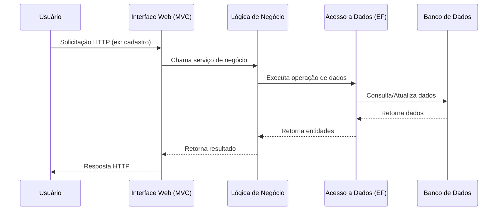

# Uranus – Documentação Técnica

## Sumário

1. [Visão Geral](#visão-geral)
2. [Arquitetura e Componentes](#arquitetura-e-componentes)
3. [Tecnologias Utilizadas](#tecnologias-utilizadas)
4. [Funcionamento Técnico](#funcionamento-técnico)
5. [Estrutura Detalhada dos Diretórios e Projetos](#estrutura-detalhada-dos-diretórios-e-projetos)
6. [Fluxo de Dados e Comunicação](#fluxo-de-dados-e-comunicação)
7. [Padrões de Projeto Utilizados](#padrões-de-projeto-utilizados)
8. [Detalhamento dos Principais Módulos](#detalhamento-dos-principais-módulos)
9. [Configuração do Ambiente de Desenvolvimento](#configuração-do-ambiente-de-desenvolvimento)
10. [Processo de Build e Deploy](#processo-de-build-e-deploy)
11. [Integração com Sistemas Externos](#integração-com-sistemas-externos)
12. [Segurança e Boas Práticas](#segurança-e-boas-práticas)
13. [Governança de Dados](#governança-de-dados)
14. [Testes Automatizados e Manuais](#testes-automatizados-e-manuais)
15. [Troubleshooting e Dúvidas Frequentes](#troubleshooting-e-dúvidas-frequentes)
16. [Padrão de Codificação](#padrão-de-codificação)
17. [Contribuição e Governança do Código](#contribuição-e-governança-do-código)
18. [Roadmap e Evolução do Sistema](#roadmap-e-evolução-do-sistema)
19. [Histórico de Versões (Changelog)](#histórico-de-versões-changelog)
20. [Glossário Técnico](#glossário-técnico)
21. [Referências e Contatos](#referências-e-contatos)

---

## Visão Geral

O sistema Uranus é uma solução corporativa desenvolvida em .NET Framework 4.7.2, projetada para atender demandas de alta complexidade e escalabilidade. Sua arquitetura modular adota as melhores práticas de engenharia de software, promovendo separação de responsabilidades, manutenibilidade e facilidade de evolução.

O Uranus atende a múltiplos domínios de negócio, sendo utilizado em ambientes críticos, com alto volume de dados e integrações com sistemas legados e modernos.

## Arquitetura e Componentes

A solução é composta por múltiplos projetos, cada um responsável por uma camada ou funcionalidade específica:

- **Uranus (Núcleo da Aplicação):** Contém a interface web baseada em ASP.NET MVC, arquivos de visualização (`.cshtml`), scripts SQL e integrações principais.
- **Uranus.App:** Projeto de aplicação web, responsável pelos controladores (Controllers) e visualizações (Views), reforçando a adoção do padrão MVC.
- **Uranus.Business:** Camada de lógica de negócio, centralizando as regras e operações do domínio, garantindo reutilização e isolamento da lógica empresarial.
- **Uranus.Data:** Camada de acesso a dados, utilizando Entity Framework (Database First) para integração com o banco de dados SQL Server. Inclui modelos, contexto de dados e arquivos `.edmx` para mapeamento objeto-relacional.
- **Uranus.Domain:** Define as entidades, contratos e objetos de valor do domínio, promovendo um modelo de dados consistente e alinhado aos requisitos de negócio.
- **Uranus.Suite:** Projeto dedicado a funcionalidades auxiliares, automações, integrações externas ou testes automatizados, conforme necessidades do sistema.
- **Uranus.WindowsService:** Serviço Windows responsável por processamentos assíncronos, tarefas agendadas e operações de longa duração, garantindo robustez e performance.
- **Recursos:** Diretório destinado a arquivos de recursos compartilhados entre os projetos.

## Tecnologias Utilizadas

- **.NET Framework 4.7.2**
- **ASP.NET MVC** (arquivos `.cshtml`)
- **Entity Framework** (Database First, arquivos `.edmx`)
- **SQL Server** (scripts SQL e integração via EF)
- **Serviço Windows**
- **Controle de versão com Git**
- **IIS (Internet Information Services)** para hospedagem
- **PowerShell** para automação de tarefas administrativas

## Funcionamento Técnico

O Uranus segue o padrão multicamadas, onde a interface web interage com a camada de negócio, que por sua vez manipula os dados através da camada de acesso a dados. O uso do Entity Framework Database First permite que as alterações no banco de dados sejam refletidas diretamente nos modelos do sistema, facilitando a manutenção e evolução.

O serviço Windows opera em paralelo à aplicação principal, executando tarefas críticas em background, como processamento de filas, integrações ou rotinas agendadas.

A estrutura modular da solução facilita a integração com outros sistemas, a realização de testes automatizados e a implementação de novas funcionalidades, mantendo o alto padrão de qualidade exigido em ambientes corporativos.

## Estrutura Detalhada dos Diretórios e Projetos

A seguir, um detalhamento dos principais diretórios e arquivos presentes na solução Uranus:

```text
/
├── Uranus/                # Núcleo da aplicação, interface web, integrações
│   ├── Index.cshtml       # Página principal
│   ├── Views/             # Arquivos de visualização
│   ├── _Layout.cshtml     # Layout compartilhado
│   ├── R9.DataBase/       # Scripts e objetos de banco de dados
│   ├── Uranus.App/        # Projeto de aplicação web
│   ├── Uranus.Business/   # Lógica de negócio
│   ├── Uranus.Data/       # Modelos e contexto EF
│   ├── Uranus.Domain/     # Entidades e contratos de domínio
│   ├── Uranus.Suite/      # Funcionalidades auxiliares
│   ├── Uranus.WindowsService/ # Serviço Windows
│   ├── html2openxml-dev/  # Conversão de HTML para OpenXML
│   └── rodape.jpg         # Imagem de rodapé
├── Uranus.sln             # Solução principal
├── Recursos/              # Recursos compartilhados
└── README.md              # Documentação
```

### Descrição dos Projetos

- **Uranus.sln**: Arquivo de solução, agrega todos os projetos.
- **Uranus.App**: Responsável pela interface web, controladores e visualizações.
- **Uranus.Business**: Implementa regras de negócio e orquestra operações.
- **Uranus.Data**: Define modelos de dados, contexto e integrações com o banco.
- **Uranus.Domain**: Contém entidades, enums, interfaces e contratos do domínio.
- **Uranus.Suite**: Suporte a integrações, automações e testes.
- **Uranus.WindowsService**: Serviço para execução de tarefas em background.
- **Recursos**: Armazena arquivos compartilhados, como imagens, scripts e templates.

## Fluxo de Dados e Comunicação

O fluxo de dados no Uranus segue o padrão MVC e multicamadas, conforme ilustrado abaixo:



### Comunicação entre Projetos

- **Web ↔ Business:** Via injeção de dependência e contratos de serviço.
- **Business ↔ Data:** Utiliza repositórios e padrões de unidade de trabalho.
- **Data ↔ Banco:** Entity Framework gerencia conexões, transações e mapeamento.
- **WindowsService ↔ Data/Business:** Executa operações agendadas ou em lote.

## Padrões de Projeto Utilizados

O Uranus adota diversos padrões de projeto para garantir robustez e manutenibilidade:

- **MVC (Model-View-Controller):** Organização da interface web.
- **Repository:** Abstração do acesso a dados.
- **Unit of Work:** Gerenciamento de transações.
- **Dependency Injection:** Injeção de dependências para serviços e repositórios.
- **DTO (Data Transfer Object):** Transferência de dados entre camadas.
- **Service Layer:** Centralização da lógica de negócio.
- **Singleton:** Para serviços compartilhados.
- **Factory:** Criação de instâncias de objetos complexos.
- **Observer:** Notificações e eventos internos.

## Detalhamento dos Principais Módulos

### Uranus.App

- Controladores responsáveis por receber requisições HTTP e orquestrar respostas.
- Views implementadas em Razor (`.cshtml`), com uso de layouts e partials para reaproveitamento de código.
- Validação de entrada via DataAnnotations e filtros personalizados.

### Uranus.Business

- Serviços de negócio encapsulam regras e fluxos críticos.
- Implementação de validações, cálculos, orquestração de processos e notificações.
- Utilização de logs para rastreabilidade de operações.

### Uranus.Data

- Mapeamento objeto-relacional via Entity Framework.
- Contexto de dados (`DbContext`) configurado para múltiplos ambientes.
- Repositórios genéricos e específicos para entidades do domínio.

### Uranus.Domain

- Entidades ricas com métodos e validações próprias.
- Enumerações, objetos de valor e contratos de serviço.

### Uranus.Suite

- Implementação de integrações com sistemas externos.
- Automação de tarefas administrativas e testes automatizados.

### Uranus.WindowsService

- Execução de tarefas em background, como processamento de filas, notificações e integrações.
- Monitoramento de status e logs de execução.

## Configuração do Ambiente de Desenvolvimento

### Pré-requisitos

- Windows 10 ou superior
- Visual Studio 2019 ou superior
- .NET Framework 4.7.2 SDK
- SQL Server 2016 ou superior
- Git
- IIS (Internet Information Services)

### Passos para Configuração

1. Clone o repositório:
   ```powershell
   git clone <url-do-repositorio>
   ```
2. Abra a solução `Uranus.sln` no Visual Studio.
3. Restaure os pacotes NuGet.
4. Configure o arquivo `Web.config` com as strings de conexão apropriadas.
5. Execute os scripts SQL do diretório `R9.DataBase` para criar o banco de dados.
6. Compile a solução.
7. Configure o IIS para apontar para o diretório da aplicação web.
8. Inicie o serviço Windows utilizando o Gerenciador de Serviços do Windows.

### Variáveis de Ambiente

- `URANUS_DB_CONNECTION`: String de conexão com o banco de dados.
- `URANUS_ENVIRONMENT`: Ambiente de execução (Desenvolvimento, Homologação, Produção).

## Processo de Build e Deploy

### Build

- O build é realizado pelo Visual Studio ou via linha de comando:
  ```powershell
  msbuild Uranus.sln /p:Configuration=Release
  ```
- O build gera os artefatos necessários para publicação no IIS e instalação do serviço Windows.

### Deploy

- O deploy da aplicação web é realizado via publicação no IIS.
- O serviço Windows é instalado utilizando o utilitário `sc.exe` ou via instalador MSI.
- Recomenda-se o uso de pipelines CI/CD para automação do deploy.

### Exemplo de Instalação do Serviço Windows

```powershell
sc create UranusService binPath= "C:\Caminho\Para\Uranus.WindowsService.exe"
```

## Integração com Sistemas Externos

O Uranus integra-se com diversos sistemas externos, incluindo:

- Sistemas legados via WebServices (SOAP/REST)
- Integração com ERPs
- Serviços de autenticação (LDAP, OAuth)
- Gateways de pagamento
- Serviços de envio de e-mail e notificações

### Exemplo de Consumo de API Externa

```csharp
using (var client = new HttpClient())
{
    client.BaseAddress = new Uri("https://api.externosistema.com");
    var response = await client.GetAsync("/endpoint/dados");
    if (response.IsSuccessStatusCode)
    {
        var dados = await response.Content.ReadAsAsync<DadosDTO>();
        // Processar dados
    }
}
```

## Segurança e Boas Práticas

- Autenticação baseada em cookies e integração com Active Directory.
- Autorização por perfis e claims.
- Criptografia de dados sensíveis em trânsito e em repouso.
- Validação de entrada e prevenção contra ataques de injeção (SQL Injection, XSS).
- Logs de acesso e operações críticas.
- Backup regular do banco de dados.
- Atualizações periódicas de dependências.

## Governança de Dados

- Controle de versionamento do esquema do banco de dados.
- Auditoria de operações críticas (CRUD).
- Políticas de retenção e descarte seguro de dados.
- Conformidade com LGPD e demais legislações aplicáveis.

## Testes Automatizados e Manuais

- Testes unitários com MSTest/xUnit/NUnit.
- Testes de integração simulando fluxos reais.
- Testes de interface utilizando Selenium.
- Testes de carga e performance.
- Estratégias de mocks e stubs para dependências externas.

### Exemplo de Teste Unitário

```csharp
[TestMethod]
public void Deve_Calcular_Total_Correto()
{
    var pedido = new Pedido();
    pedido.AdicionarItem(new Item(10));
    pedido.AdicionarItem(new Item(20));
    Assert.AreEqual(30, pedido.Total);
}
```

## Troubleshooting e Dúvidas Frequentes

### Problemas Comuns

- **Erro de conexão com banco:** Verifique a string de conexão e permissões do usuário.
- **Falha no build:** Confirme versões do .NET Framework e pacotes NuGet.
- **Serviço Windows não inicia:** Consulte os logs em `C:\Logs\UranusService.log`.
- **Problemas de permissão:** Execute o IIS e o serviço como usuário com privilégios adequados.

### Dicas de Diagnóstico

- Utilize ferramentas como Fiddler, Postman e SQL Profiler para depuração.
- Habilite logs detalhados em ambiente de desenvolvimento.
- Consulte o Event Viewer do Windows para erros do serviço.

## Padrão de Codificação

- Utilização do padrão UTF-8 para todos os arquivos.
- Nomenclatura de classes, métodos e variáveis conforme convenção C#.
- Separação clara entre camadas.
- Comentários claros e objetivos.
- Utilização de regions para organização de código extenso.
- Validação de parâmetros obrigatórios.
- Tratamento de exceções com logs detalhados.
- Revisão de código obrigatória via Pull Requests.

## Contribuição e Governança do Código

- Fork do repositório e criação de branches para novas features ou correções.
- Pull Requests revisados por pelo menos dois membros do time.
- Commits semânticos e descritivos.
- Documentação obrigatória para novas funcionalidades.
- Manutenção de histórico de decisões arquiteturais.
- Utilização de issues para rastreamento de demandas.

## Roadmap e Evolução do Sistema

- Integração com novos provedores de autenticação.
- Migração gradual para .NET 6+.
- Ampliação da cobertura de testes automatizados.
- Evolução da interface web para SPA com Angular/React.
- Implementação de microsserviços para módulos críticos.
- Otimização de performance e escalabilidade.

## Histórico de Versões (Changelog)

- **v1.0.0** – Estrutura inicial, funcionalidades básicas, integração com banco de dados.
- **v1.1.0** – Adição de integrações externas, melhorias de segurança.
- **v1.2.0** – Refatoração de módulos, aumento da cobertura de testes.
- **v1.3.0** – Implementação do serviço Windows para automações.
- **v1.4.0** – Otimizações de performance e correções de bugs.

## Glossário Técnico

- **MVC:** Model-View-Controller, padrão de arquitetura para separar lógica de apresentação, negócio e dados.
- **Entity Framework:** ORM para .NET, facilita o acesso a dados relacionais.
- **DTO:** Data Transfer Object, objeto para transferência de dados entre camadas.
- **Repository:** Padrão para abstração do acesso a dados.
- **Unit of Work:** Gerenciamento de transações.
- **SPA:** Single Page Application.

## Referências e Contatos

- Documentação oficial do .NET: https://docs.microsoft.com/dotnet/
- Documentação Entity Framework: https://docs.microsoft.com/ef/
- Documentação ASP.NET MVC: https://docs.microsoft.com/aspnet/mvc/
- Contato: time de desenvolvimento da PontoBR

---

Para mais detalhes sobre configuração, implantação ou contribuição, consulte a documentação interna ou entre em contato com o time de desenvolvimento da PontoBR.

<!--
Este README foi gerado automaticamente com base na estrutura do sistema Uranus.
Atualize este documento conforme a evolução do sistema e mantenha-o como referência central para desenvolvedores e stakeholders.
-->

A estrutura modular da solução facilita a integração com outros sistemas, a realização de testes automatizados e a implementação de novas funcionalidades, mantendo o alto padrão de qualidade exigido em ambientes corporativos.

## Estrutura de Diretórios (Resumo)

- `Uranus/` – Aplicação principal e arquivos de interface
- `Uranus.App/` – Controladores e visualizações web
- `Uranus.Business/` – Lógica de negócio
- `Uranus.Data/` – Acesso a dados e modelos EF
- `Uranus.Domain/` – Entidades e contratos de domínio
- `Uranus.Suite/` – Funcionalidades auxiliares e integrações
- `Uranus.WindowsService/` – Serviço Windows
- `Recursos/` – Recursos compartilhados

---

Para mais detalhes sobre configuração, implantação ou contribuição, consulte a documentação interna ou entre em contato com o time de desenvolvimento da PontoBR.
